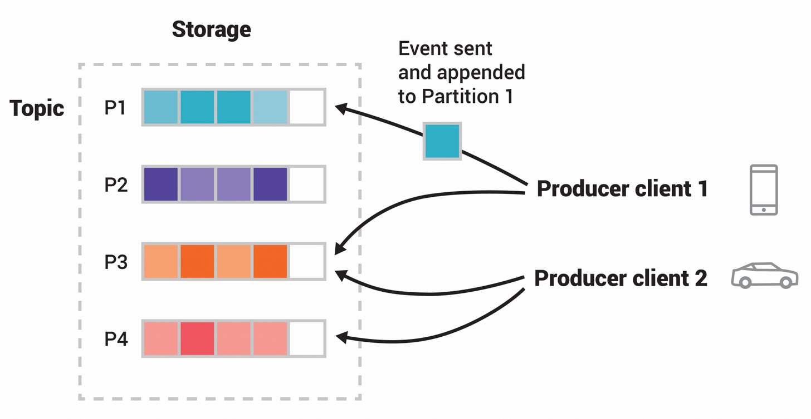

# Kafka
> kafka(集群) 是一个<mark>分布式</mark> 的 <mark>高可用</mark> 的发布/订阅 <mark>消息队列</mark>

官网 [https://kafka.apache.org/](https://kafka.apache.org/)


**安装**

```bash
docker run --name kafka -p 9092:9092 -d apache/kafka:latest


# 监控会收到高级listen控制
java  kafka-ui-api-v0.7.2.jar --spring.config.additional-location=config.yaml

> config.yaml
kafka:
  clusters:
    - name: local
      bootstrapServers: "localhost:9092"
```


**常用命令**
```bash
# 创建主题
./kafka-topics.sh --bootstrap-server localhost:9092 --create --topic my_topic

# 生产者
./kafka-console-producer.sh --bootstrap-server localhost:9092 --topic my_topic

# 消费者
#  --from-beginning 表示从头开始读取消息
#  --group my_group 消费者组
#  --property print.partition=true 打印消息来源分区
./kafka-console-consumer.sh --bootstrap-server localhost:9092 --topic my_topic

```

**UI管理界面**

```bash
# 还可设置动态配置
java -jar kafka-ui-api-v0.7.2.jar --spring.config.additional-location=./config.yaml

> ./config.yaml
kafka:
  clusters:
    - name: local
      bootstrapServers: "localhost:9092"
```


<!-- 


- `topic` 是逻辑上概念
- `partition` 是物理上的概念
- `offset` 是分区中的消息位置


## 角色

- `Producer`生产者 

- `Consumer`消费者 

- 消费者组 

- 服务者 broker

- 控制器 Controller

- 集群


图：此示例主题包含四个分区 P1–P4。两个不同的生产者客户端彼此独立地通过网络将事件写入主题的各个分区，从而向主题发布新事件。具有相同键（图中以颜色表示）的事件将被写入同一分区。请注意，如果适用，两个生产者都可以写入同一分区。

分区可以设置副本当存在三个节点，会保持数据始终可用。 -->


