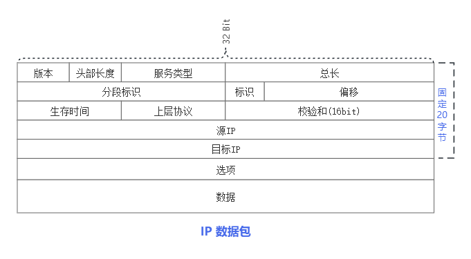
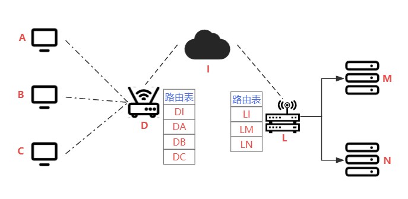

## IPv4

> Internet Protocol(互联网)，IP协议通过IP地址来进行全球的数据通讯。https://datatracker.ietf.org/doc/html/rfc791

### IP数据格式

| 字段                        | 长度 | 描述                                      |
|-----------------------------|------|-------------------------------------------|
| 版本 (Version)              | 4位  | 指定IP协议的版本，IPv4为4。                 |
| 头部长度 (Header Length)    | 4位  | 指示IP头部的长度，以32位字为单位。通常为5。|
| 服务类型 (Type of Service)  | 8位  | 指定数据包的服务质量，如优先级、延迟等。  |
| 总长度 (Total Length)        | 16位 | 整个IP数据报的长度，包括头部和数据部分。    |
| 标识 (Identification)       | 16位 | 用于标识数据报的唯一性，进行重新组装。    |
| 标志 (Flags)                | 3位  | 分片相关的标志，如禁止分片、更多分片等。   |
| 片偏移 (Fragment Offset)    | 13位 | 分片相对于原始数据报的偏移量。             |
| 生存时间 (Time to Live, TTL) | 8位  | 数据报在网络中的最大寿命。每经过路由器，TTL减1，TTL为0时数据报被丢弃。|
| 协议 (Protocol)             | 8位  | 指示数据报的上层协议，如TCP、UDP、ICMP等。|
| 头部校验和 (Header Checksum)| 16位 | 用于检测IP头部的错误，提高数据传输的可靠性。|
| 源IP地址 (Source IP Address)| 32位 | 数据报的发送者的IP地址。                   |
| 目标IP地址 (Destination IP Address)| 32位 | 数据报的接收者的IP地址。                 |
| 选项 (Options)              | 可变 | 包含一些可选字段，如记录路由、时间戳等。  |
| 数据 (Data)                 | 可变 | 实际的数据部分，长度可变。                |

### IP地址

IP地址共有4字节所有可用的IP总数为255⁴ （0.0.0.0）- （255.255.255.255） 其中还有很多（[特殊IP标注](https://www.iana.org/assignments/iana-ipv4-special-registry/iana-ipv4-special-registry.xhtml)）。互联网的高速发展造成IP消耗较严重，目前分别有两个方法来缓解，NET转发，IPv6等。

### IP寻址
Q:
1. 设备是如何准确的通过互联网来访问到指定的主机的，流程是怎么样的？
    - 
    - 通过IP路由表串口来访问各种设备。例A->DA-DI->LI-LM->M 来完成了A->M的访问

### NAT转换

> 通过程序来解析包中的内部IP替换为公网IP来完成nat转换。

#### NAT

| 内网IP      | 外网IP       |
|-------------|--------------|
| 192.168.1.1 | 39.156.66.10 |
| 192.168.1.2 | 39.156.66.11 |
| 192.168.1.3 | 39.156.66.12 |

#### NAPT

| 内网IP        | 外网IP          |
|---------------|-----------------|
| 192.168.1.1:80 | 39.156.66.10:22000 |
| 192.168.1.2:80 | 39.156.66.10:22001 |
| 192.168.1.1:443| 39.156.66.10:22002 |
