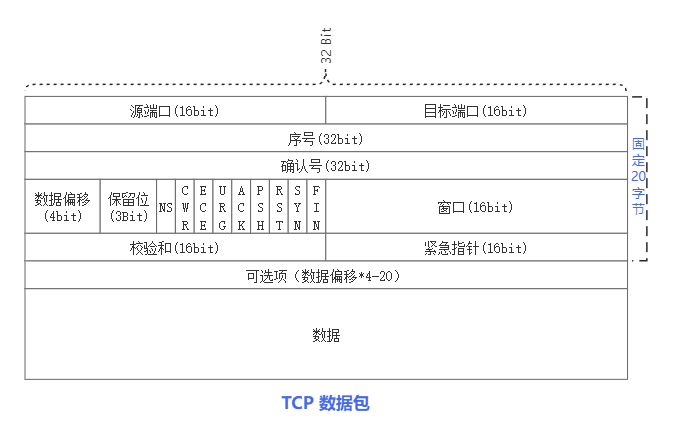
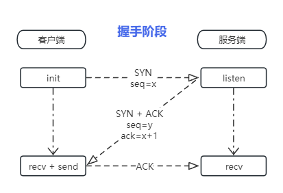

## TCP

### 报文头

- 源端口：
  - 长度：16bit
  - 作用：用来确定是那个进程使用的tcp包，可以根据端口来确定发送进程。
- 目标端口：目标端口与源端口功能类似，用来表示对端。
- 序号：
  - 长度：32bit
  - 作用：在不通的阶段有不通的作用
    - SYN握手阶段：初始化一个数字（通常为0）发送给对端，并逐次+=1
    - PSH传输阶段：本包第一字节在所有数据中的序号。
- 确认号：
  - 长度：32bit
  - 作用：仅ACK的标志位为1的时候确认号才有效。确认号为期望对端的发送的手字节序号。
- 数据偏移：tcp头长度，也表示数据开始位置
  - 长度：4bit
  - 作用：结果需要乘4，则最小为固定长度20（tcp头固定长度），最大表示为|1111|\*4=60(所以tcp头长度不能超过60)
- Flags：对应位为1则表示当前flag
    - ns （Explicit Congestion Notification）显式拥塞通知
    - cwr (Congestion Window Reduced) 拥塞窗口减少
    - ece ECN-Echo
    - urg 高优先级数据包
    - ACK 确认序号
    - PSH 传输数据
    - RST 出现严重差错，要求断开或重连
    - SYN 表示连接请求或连接接受报文
    - fin 要求释放连接
- 窗口：表示从确认号开始，本报文的发送方可以接收的字节数，即接收窗口大小。用于流量控制。
- 校验和：
- 紧急指针：
- 可选项：一组和多组kind类数据
  - 长度：数据偏移-20固定字节
  - Kind
    - 0x00: 结束选项列表
    - 0x01: 无操作
    - 0x02: Maximum segment size (最大分段大小)
    - 0x03: 窗口扩大因子
    - 0x04: 选择性确认(SACK)
    - 0x05: 时间戳

### 握手

1. 首先客户端发送握手请求（一个SYN包）到服务器。
2. 服务器收到SYN包后会创建缓冲并将客户端发送SYN和ACK标志位的包表示同意连接。
3. 客户端则再次回复ACK包通知服务器，至此tcp握手完成。

Q:
1. 如果客户端发送SYN 服务器除了应答还会怎么处理呢？
   - 不应答 会触发连接超时 开启防火墙通常就是不应答。
   - 拒绝 直接回复RST包，直接进行拒绝 端口为监听。
2. 如果客户端收到服务器的同意请求 如果不回复会怎么样？
   - 这样会造成资源浪费，服务器会在回复同意后创建接收缓存。批量操作会造成 SYN泛洪攻击。

### 传输阶段

