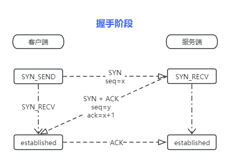

## TCP

### 报文头

- 序号seq：
  - SYN: seq为初始x,如果已经存在x则为x+1
  - PSH: seq为发送报文的首字节的序列号

- 确认号ack：仅ACK的flag为1确认号有效。 确认号为期望对端的序号内容。

- 数据偏移(4bit)：tcp头长度，也表示数据开始位置，结果需要乘4，则最小为固定长度|0101|\*4=20，最大表示为|1111|\*4=60.
- Flags：对应位为1则表示当前flag
    - ns （Explicit Congestion Notification）显式拥塞通知
    - cwr (Congestion Window Reduced) 拥塞窗口减少
    - ece ECN-Echo
    - urg 高优先级数据包
    - ACK 确认序号
    - PSH 传输数据
    - rst 出现严重差错
    - SYN 表示连接请求或连接接受报文，syn会告诉对方自己的窗口大小，
    - fin 要求释放连接
- 窗口：表示从确认号开始，本报文的发送方可以接收的字节数，即接收窗口大小。用于流量控制。
- 校验和：
- 紧急指针：

### 握手

1. 首先客户端发送握手请求（一个SYN包）到服务器。其中SYN包携带了初始的seq序号（通常为0）。和窗口（接收缓冲区）大小。

2. 服务器收到SYN包后会创建缓冲并将客户端发送SYN和ACK