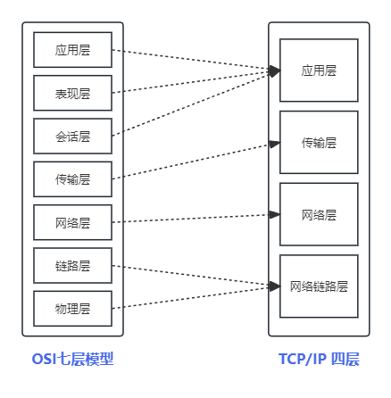

# TCP/IP模型
> TCP/IP协议簇将网络模型划分为4层，但是OSI模型分为7层。OSI模型为概念模型，通常用于教育与理论研究。实际开发中通常使用TCP/IP 4层概念进行。详情请对比下图。




## 应用层

> http，ftp， 邮件应用，和我们自己封装的一些基于tcp，udp协议都属于应用层。这是编程领域最常用的逻辑层级。

## 传输层

> 传输层的数据帧基于网络层之上。

### TCP


 


### UDP


**通过一个获取http协议的内容来连接tcp/ip模型的大概工作流程**

我们执行命令 `curl https://192.168.7.1/` 来查看发生了什么

- 应用层

 http通过tcp的连接发送了下面的内容文本

 ```
 GET / HTTP/1.1
 Host: 192.168.7.1
 User-Agent: curl/7.81.0
 Accept: */*
 
 ```
 这时候的http是不关注下层协议的。会直接将内容交给下层进行处理。

 - 传输层


## 1.物理层 

> 进行设备间“点对点”的连接。

物理层主要解决在各种设备间互相传输比特流的。为了解决这个问题，进行了一大堆的标准来进行规范。

Q1. 如何进行双全工数据传输的。


## 2. 链路层

> 对物理层传输的比特数据进行逻辑处理。 

Q1. 传输如何开始和结束
> 通过封装为帧的概念来处理信号的开始和结束。

Q2. 传输给谁
> 通过mac地址与连接其他设备的 “接口” 进行数据传输。明白数据应该传输给谁。

**以太网帧**

| 帧头 SOH | 帧数据 | 帧尾EOT |
| :-- | :--: | --: |
| --> | 数据长度限制为 ≤ MTU  | <-- |

**帧数据 MAC层**

| Dst MAC | Src MAC | Type  | Data |  FCS |
| -- | -- | --  | -- | -- |
| 6Byte 目的串口 | 6Byte 发送串口 | 2Byte 数据类型  | 数据 | 4Byte 校验 |

### 封装成帧

数据链路层的协议数据单元。帧头，数据，帧尾。这时候接收端收到帧头就知道有数据传输过来了，如果读取到帧尾就知道数据传输结束了。

### 透明传输

透明传输的意思为帧数据中如果出现了与EOT相同的字节怎么办，这时候就需要用到转义符。与编程概念类似。

### 差错检测

使用crc进行数据校验来保证传输的数据正确。

## 3. 网络层
> 对数据进行转发，不仅仅进行相邻设备进行数据传送。

**IP数据**

| 字段                        | 长度 | 描述                                      |
|-----------------------------|------|-------------------------------------------|
| 版本 (Version)              | 4位  | 指定IP协议的版本，IPv4为4。                 |
| 头部长度 (Header Length)    | 4位  | 指示IP头部的长度，以32位字为单位。通常为5。|
| 服务类型 (Type of Service)  | 8位  | 指定数据包的服务质量，如优先级、延迟等。  |
| 总长度 (Total Length)        | 16位 | 整个IP数据报的长度，包括头部和数据部分。    |
| 标识 (Identification)       | 16位 | 用于标识数据报的唯一性，进行重新组装。    |
| 标志 (Flags)                | 3位  | 分片相关的标志，如禁止分片、更多分片等。   |
| 片偏移 (Fragment Offset)    | 13位 | 分片相对于原始数据报的偏移量。             |
| 生存时间 (Time to Live, TTL) | 8位  | 数据报在网络中的最大寿命。每经过路由器，TTL减1，TTL为0时数据报被丢弃。|
| 协议 (Protocol)             | 8位  | 指示数据报的上层协议，如TCP、UDP、ICMP等。|
| 头部校验和 (Header Checksum)| 16位 | 用于检测IP头部的错误，提高数据传输的可靠性。|
| 源IP地址 (Source IP Address)| 32位 | 数据报的发送者的IP地址。                   |
| 目标IP地址 (Destination IP Address)| 32位 | 数据报的接收者的IP地址。                 |
| 选项 (Options)              | 可变 | 包含一些可选字段，如记录路由、时间戳等。  |
| 数据 (Data)                 | 可变 | 实际的数据部分，长度可变。                |


### IPv4地址分类

| 分类       | 前缀码 | 开始地址          | 结束地址            | 对应CIDR修饰 | 默认子网掩码     |
|------------|--------|------------------|--------------------|--------------|------------------|
| A类地址    | 0      | 0.0.0.0          | 127.255.255.255    | /8           | 255.0.0.0        |
| B类地址    | 10     | 128.0.0.0        | 191.255.255.255    | /16          | 255.255.0.0      |
| C类地址    | 110    | 192.0.0.0        | 223.255.255.255    | /24          | 255.255.255.0   |
| D类地址 （群播） | 1110   | 224.0.0.0        | 239.255.255.255    | /4           | 未定义             |
| E类地址 （保留） | 1111   | 240.0.0.0        | 255.255.255.255    | /4           | 未定义             |


**特殊IP** [rfc3330](https://datatracker.ietf.org/doc/html/rfc3330)

专用网络保留IP段

| 名称 | CIDR块 | 地址范围 | 地址数量 | 分类描述 |
|------|-------|----------|---------|-------|
| 24位块 | 10.0.0.0/8 | 10.0.0.0 – 10.255.255.255 | 16777216 | 单一的A类地址块 |
| 20位块 | 172.16.0.0/12 | 172.16.0.0 – 172.31.255.255 | 1048576 | 连续的16个B类地址块 |
| 16位块 | 192.168.0.0/16 | 192.168.0.0 – 192.168.255.255 | 65536 | 连续的256个C类地址块 |

### IP子网

如果获取一个网段，对网段进行划分，划分的部分则为子网。

### NAT网络转换

nat转换则是对私有网络进行公网IP进行保留IP和公网IP进行替换。
