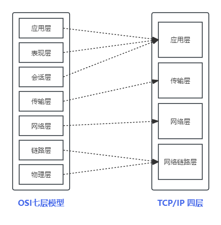

# Linux 网络学习笔记


## 网络模型
> TCP/IP协议簇将网络模型划分为4层，但是OSI模型分为7层。OSI模型为概念模型，通常用于教育与理论研究。实际开发中通常使用TCP/IP 4层概念进行。详情请对比下图。




## 工作原理


## 名词

- WAN 广域网
- LAN 局域网
- Byte 字节单位 1byte=8bit
- BPS  每秒传输单位 1bit/s
- 信道
    - 单工
    - 半双工
    - 全双工

#### NAT
>网络地址转换(Network Address Translation) 是一种网络地址转换技术，它可以将内部网络的 IP 地址转换为公共 IP 地址。  

##### 地址转换 (Address Translation)
地址转换是指将内部网络的 IP 地址转换为公共 IP 地址。在这种方式下，内部网络的设备都共享一个公共 IP 地址，发送到外部网络的数据包会被路由器转换为公共 IP 地址发送出去。

##### 隧道(Tunneling)
隧道是指将整个 IP 数据报封装在另一个 IP 数据报中，并将其发送到目的地。在这种方式下，内部网络的设备都有自己的公共 IP 地址，发送到外部网络的数据包会被封装在另一个 IP 数据报中发送出去。

## 网络设备

### 物理网卡

...

**以太网虚拟网卡设备,虚拟网卡上网需要将Linux设置为“路由器模式”启用IP转发并配置NAT规则，才能通过物理网口进行出网。**

### tap虚拟设备
tap设备位于OSI模型的第二层。
### tun虚拟设备
>tun设备位于OSI模型的第三层。
```bash
#查看网络设备
ip link show

#增加tun设备
ip tuntap add dev tun0 mode tun

#删除tun设备
ip link del tun0

#启用TUN设备
ip link set dev tun0 up

#关闭设备
ip link set tun0 down

#分配IP
ip addr add 10.0.0.1/24 dev tun0

#设置路由 
ip route add 10.0.0.0/24 dev tun0
```

## iptables
> iptables 是 Linux 内核中的一个防火墙管理工具。它可以用来控制网络数据包的流动，并对数据包进行过滤、转发、转换等操作。其他的Linux防火墙工具都是基于iptables之上的封装。

### 查看放开的端口
```shell
iptables -L -n
```

### 放行与删除端口
> 放行后需要进行保存，不然重启后会丢失操作
```shell
iptables -A INPUT -p <protocol> --dport <port> -j ACCEPT

iptables -D INPUT -p <protocol> --dport <port> -j ACCEPT
```


### NAT表 
- 开启IP转发功能

    `echo 1 > /proc/sys/net/ipv4/ip_forward`

- 将 `10.0.0.0/8` 的流量都通过`eth0`进行NAT转换进行出网

    `iptables -t nat -A POSTROUTING -s 10.0.0.0/8 -o eth0 -j MASQUERADE`


### UDP


**通过一个获取http协议的内容来连接tcp/ip模型的大概工作流程**

我们执行命令 `curl https://192.168.7.1/` 来查看发生了什么

- 应用层

 http通过tcp的连接发送了下面的内容文本

 ```
 GET / HTTP/1.1
 Host: 192.168.7.1
 User-Agent: curl/7.81.0
 Accept: */*
 
 ```
 这时候的http是不关注下层协议的。会直接将内容交给下层进行处理。

 - 传输层


## 1.物理层 

> 进行设备间“点对点”的连接。

物理层主要解决在各种设备间互相传输比特流的。为了解决这个问题，进行了一大堆的标准来进行规范。

Q1. 如何进行双全工数据传输的。


## 2. 链路层

> 对物理层传输的比特数据进行逻辑处理。 

Q1. 传输如何开始和结束
> 通过封装为帧的概念来处理信号的开始和结束。

Q2. 传输给谁
> 通过mac地址与连接其他设备的 “接口” 进行数据传输。明白数据应该传输给谁。

**以太网帧**

| 帧头 SOH | 帧数据 | 帧尾EOT |
| :-- | :--: | --: |
| --> | 数据长度限制为 ≤ MTU  | <-- |

**帧数据 MAC层**

| Dst MAC | Src MAC | Type  | Data |  FCS |
| -- | -- | --  | -- | -- |
| 6Byte 目的串口 | 6Byte 发送串口 | 2Byte 数据类型  | 数据 | 4Byte 校验 |

### 封装成帧

数据链路层的协议数据单元。帧头，数据，帧尾。这时候接收端收到帧头就知道有数据传输过来了，如果读取到帧尾就知道数据传输结束了。

### 透明传输

透明传输的意思为帧数据中如果出现了与EOT相同的字节怎么办，这时候就需要用到转义符。与编程概念类似。

### 差错检测

使用crc进行数据校验来保证传输的数据正确。

## 3. 网络层
> 对数据进行转发，不仅仅进行相邻设备进行数据传送。

**IP数据**

| 字段                        | 长度 | 描述                                      |
|-----------------------------|------|-------------------------------------------|
| 版本 (Version)              | 4位  | 指定IP协议的版本，IPv4为4。                 |
| 头部长度 (Header Length)    | 4位  | 指示IP头部的长度，以32位字为单位。通常为5。|
| 服务类型 (Type of Service)  | 8位  | 指定数据包的服务质量，如优先级、延迟等。  |
| 总长度 (Total Length)        | 16位 | 整个IP数据报的长度，包括头部和数据部分。    |
| 标识 (Identification)       | 16位 | 用于标识数据报的唯一性，进行重新组装。    |
| 标志 (Flags)                | 3位  | 分片相关的标志，如禁止分片、更多分片等。   |
| 片偏移 (Fragment Offset)    | 13位 | 分片相对于原始数据报的偏移量。             |
| 生存时间 (Time to Live, TTL) | 8位  | 数据报在网络中的最大寿命。每经过路由器，TTL减1，TTL为0时数据报被丢弃。|
| 协议 (Protocol)             | 8位  | 指示数据报的上层协议，如TCP、UDP、ICMP等。|
| 头部校验和 (Header Checksum)| 16位 | 用于检测IP头部的错误，提高数据传输的可靠性。|
| 源IP地址 (Source IP Address)| 32位 | 数据报的发送者的IP地址。                   |
| 目标IP地址 (Destination IP Address)| 32位 | 数据报的接收者的IP地址。                 |
| 选项 (Options)              | 可变 | 包含一些可选字段，如记录路由、时间戳等。  |
| 数据 (Data)                 | 可变 | 实际的数据部分，长度可变。                |


### IPv4地址分类

| 分类       | 前缀码 | 开始地址          | 结束地址            | 对应CIDR修饰 | 默认子网掩码     |
|------------|--------|------------------|--------------------|--------------|------------------|
| A类地址    | 0      | 0.0.0.0          | 127.255.255.255    | /8           | 255.0.0.0        |
| B类地址    | 10     | 128.0.0.0        | 191.255.255.255    | /16          | 255.255.0.0      |
| C类地址    | 110    | 192.0.0.0        | 223.255.255.255    | /24          | 255.255.255.0   |
| D类地址 （群播） | 1110   | 224.0.0.0        | 239.255.255.255    | /4           | 未定义             |
| E类地址 （保留） | 1111   | 240.0.0.0        | 255.255.255.255    | /4           | 未定义             |


**特殊IP** [rfc3330](https://datatracker.ietf.org/doc/html/rfc3330)

专用网络保留IP段

| 名称 | CIDR块 | 地址范围 | 地址数量 | 分类描述 |
|------|-------|----------|---------|-------|
| 24位块 | 10.0.0.0/8 | 10.0.0.0 – 10.255.255.255 | 16777216 | 单一的A类地址块 |
| 20位块 | 172.16.0.0/12 | 172.16.0.0 – 172.31.255.255 | 1048576 | 连续的16个B类地址块 |
| 16位块 | 192.168.0.0/16 | 192.168.0.0 – 192.168.255.255 | 65536 | 连续的256个C类地址块 |

### IP子网

如果获取一个网段，对网段进行划分，划分的部分则为子网。

### NAT网络转换

nat转换则是对私有网络进行公网IP进行保留IP和公网IP进行替换。
