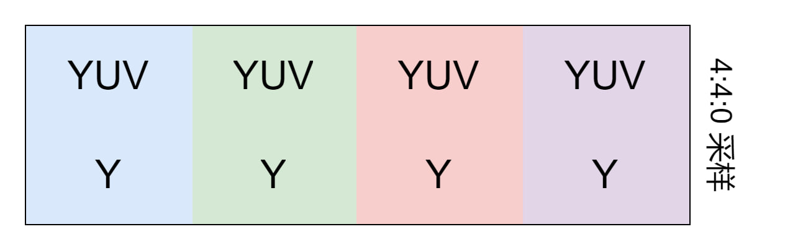

# YUV

> YUV也叫YCrCb 是一种颜色编码方法

- YCrCb(YUV) 描述如下: 
  - Y-Luminance 亮度(灰度)
  - Chrominance 色度
    - Cr(U) **r** red红色
    - Cb(V) **b** blue蓝色

- 色度采样率 (j:a:b) 形容一个以J个像素宽及两个像素高的概念上区域
    - J：水平抽样引用（概念上区域的宽度）通常为4。
    - a：在J个像素第一行中的色度抽样数目（Cr, Cb）。
    - b：在J个像素第二行中的额外色度抽样数目（Cr, Cb）。

## 色度采样

> 人的眼睛对色彩敏感度低于亮度敏感度

- 4:4:4
    

    字节流为`24`个字节`8`个像素各自展示自己颜色无压缩

- 4:4:0
    

    字节流为`16`个字节

- 4:2:2
    

    字节流为`16`个字节

- 4:2:0
    

    图像字节数为`12`个字节

- 4:1:1
    

    图像字节数为`12`个字节

## 存储为文件

```
YUV文件=全部的Y数据+全部的U数据+全部的V数据
```
一帧图片存储为YUV分为三部分Y+U+V，根据采样率来自动进行匹配到固定的位置。
不知道是谁规定的YUV数据这样存储，还挺有意思的。
