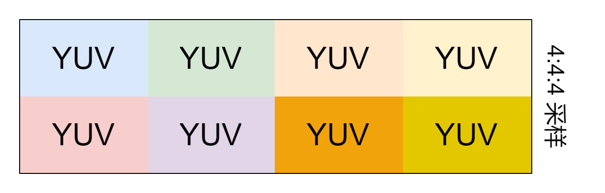
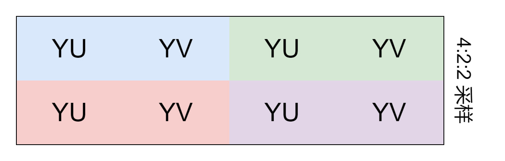
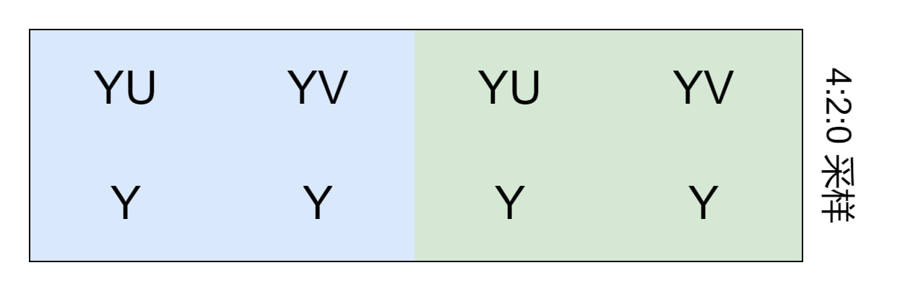
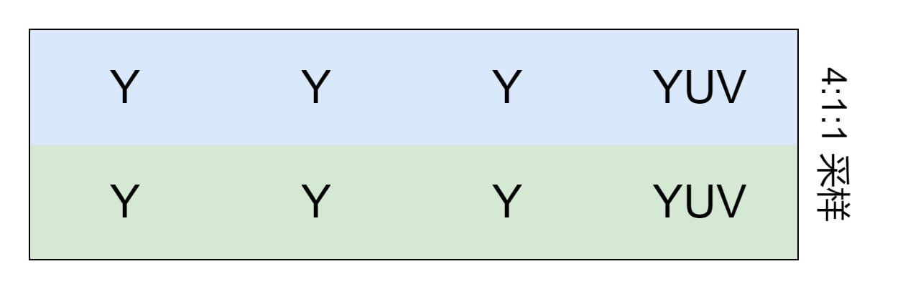

# YUV

> YUV也叫YCrCb 是一种颜色编码方法

- YCrCb(YUV) 描述如下: 
  - Y-Luminance 亮度(灰度)
  - Chrominance 色度
    - Cr(U) **r** red红色
    - Cb(V) **b** blue蓝色

- 色度采样率 (j:a:b) 形容一个以J个像素宽及两个像素高的概念上区域
    - J：水平抽样引用（概念上区域的宽度）通常为4。
    - a：在J个像素第一行中的色度抽样数目（Cr, Cb）。
    - b：在J个像素第二行中的额外色度抽样数目（Cr, Cb）。

## 

- 4:4:4
    

    压缩字节流`24`个字节

    YUV文件存储格式
    ```
    Y0,U0,V0 Y1,U1,V1 Y2,U2,V2 Y3,U3,V3 
    Y4,U4,V4 Y5,U5,V5 Y6,U6,V6 Y7,U7,V7
    ```

- 4:2:2
    

    图像字节数为`12`个字节

    YUV文件存储格式
    ```
    Y0,U0 Y1,V0 Y2,U1 Y3 V1
    ```

- 4:2:0
    

    图像字节数为`10`个字节

- 4:1:1
    

    图像字节数为`10`个字节

## YUV 文件格式