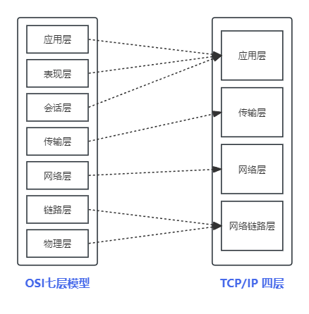

# Linux 网络学习笔记

## 网络模型
> TCP/IP协议簇将网络模型划分为4层，但是OSI模型分为7层。OSI模型为概念模型，通常用于教育与理论研究。实际开发中通常使用TCP/IP 4层概念进行。详情请对比下图。

## 网络层

| IP范围                 | 用途                                     |
|------------------------|------------------------------------------|
| 0.0.0.0                | 默认路由或未指定特定主机的地址           |
| 10.0.0.0 - 10.255.255.255 | 私有网络（私有IP地址范围）              |
| 127.0.0.0 - 127.255.255.255 | 本地回环地址（loopback）                |
| 169.254.0.0 - 169.254.255.255 | APIPA（自动配置IP地址）              |
| 172.16.0.0 - 172.31.255.255 | 私有网络（私有IP地址范围）             |
| 192.0.0.0 - 192.0.0.255  | 文档化测试目的                           |
| 192.0.2.0 - 192.0.2.255  | 文档化测试目的                           |
| 192.88.99.0 - 192.88.99.255 | IPv6到IPv4的中继服务（6to4 relay）    |
| 192.168.0.0 - 192.168.255.255 | 私有网络（私有IP地址范围）         |
| 198.18.0.0 - 198.19.255.255 | 基准测试和性能测试                       |
| 224.0.0.0 - 239.255.255.255 | 多播地址                                 |

**IP地址分类 ABCD 类 已基本废弃，目前使用 无地址分类 CIDR 方式 0.0.0.0/0**